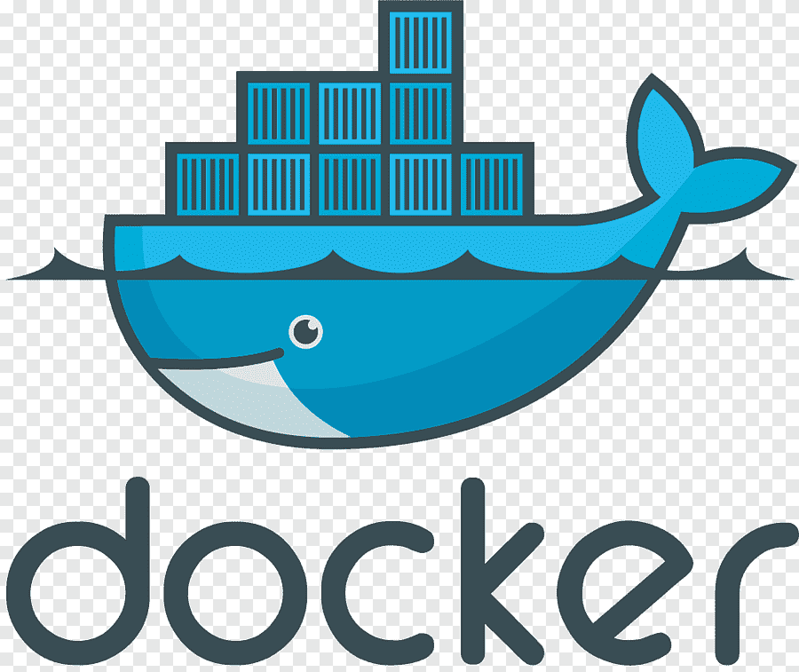

<!-- Escudos do repositório -->
<h3 align="center">GitHub</h3>

	<!-- Escudo: Contribuintes -->
	
	<!-- Escudo: Forks -->
	
	<!-- Escudo: Favoritados -->
	
	<!-- Escudo: Issues -->
	
	<!-- Escudo: Licença -->
	

<!-- Escudos de redes sociais -->
<h3 align="center">Social</h3>

	<!-- Escudo: LinkedIn -->
	
	<!-- Escudo: WhatsApp -->
	
	<!-- Escudo: Docker Hub -->
	

<!-- Logotipo do projeto e descrição -->

	 
	<!-- Logotipo -->
	
	<!-- Título -->
	<h2 align="center">PostgreSQL para TOTVS Protheus</h3>
	<!-- Descrição -->
	

		Base de dados PostgreSQL em container Docker configurada conforme os requisitos para uso com o ERP TOTVS Protheus
		 
		<a href="https://tdn.totvs.com/display/public/PROT/PostgreSQL"><strong>Documentação TOTVS</strong></a>
		 
		 
		<a href="https://hub.docker.com/r/guilhermebigois/postgres4protheus">Docker Hub do Projeto</a>
		·
		<a href="https://github.com/guilhermebigois/postgres4protheus/issues">Ajustes e Melhorias</a>
	

